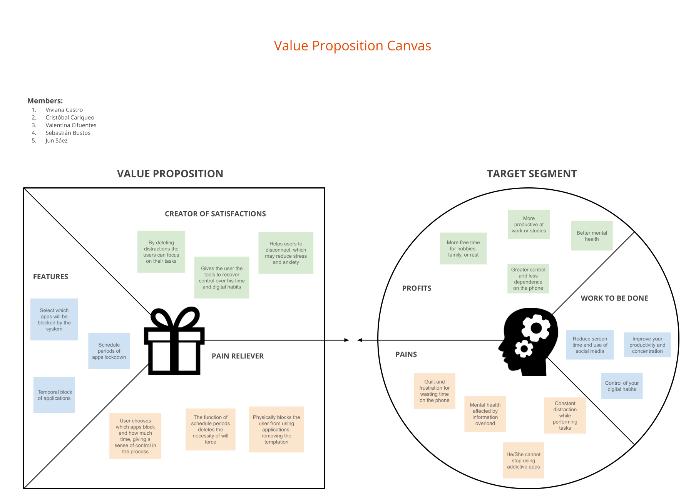
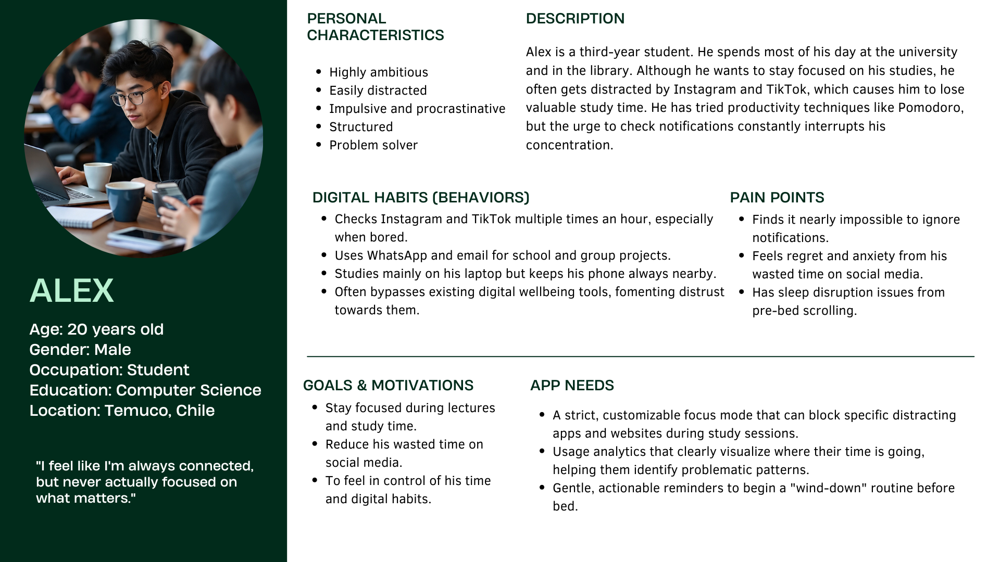
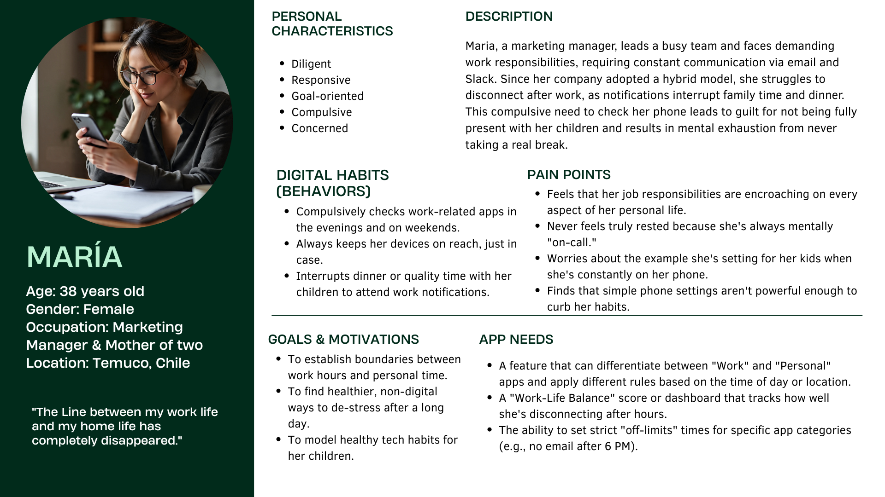
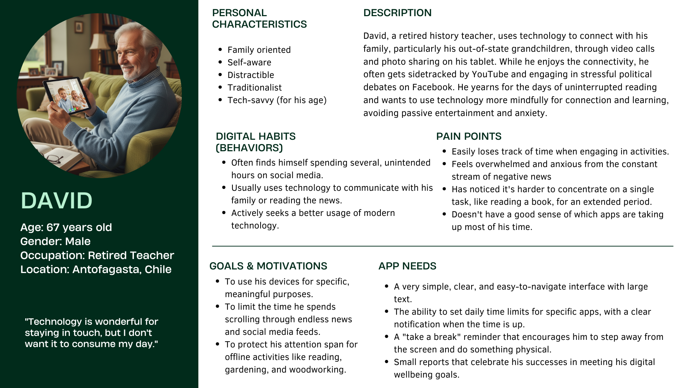
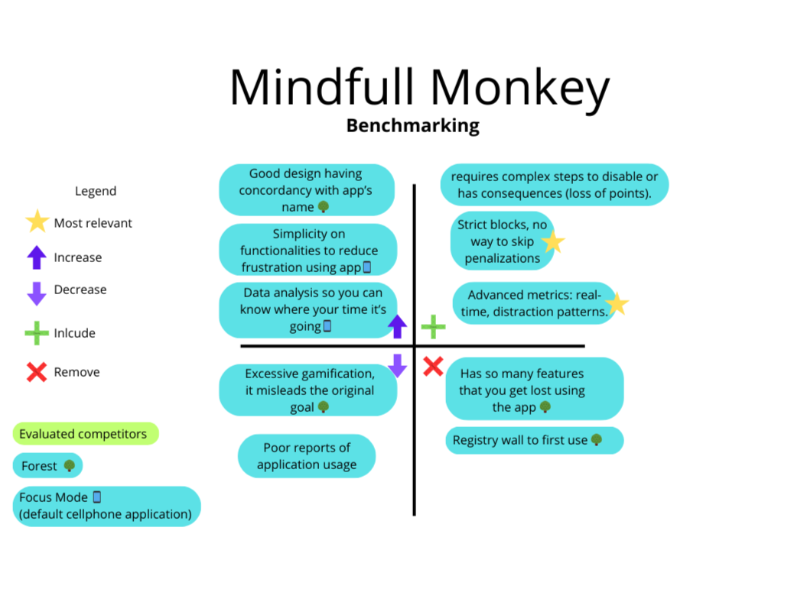
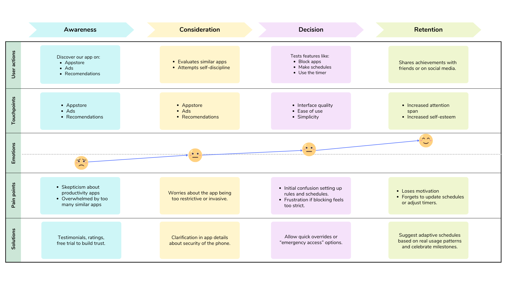
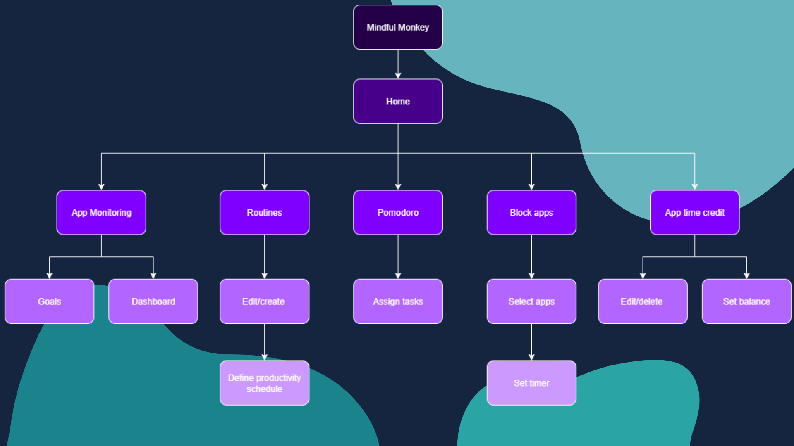

# Mindful Monkey
User Experience Design for Mindful Monkey: A productivy focused app for daily use

## Index

- [1. Introduction](#1-introduction)
    - [1.1. The Problem](#11-the-problem)
    - [1.2. Our Solution](#12-our-solution)
- [2. Team & Roles](#2-team--roles)
- [3. Strategy](#3-strategy)
    - [3.1. Value Proposition Canvas](#31-value-proposition-canvas)
    - [3.2. UX Personas](#32-ux-personas)
    - [3.3. Benchmarking](#33-benchmarking)
- [4. Scope](#4-scope)
    - [4.1 Customer Journey Map](#41-customer-journey-map)
        - [4.1.1 Decision Stage Interfaces](#411-decision-stage-interfaces)
- [5. Structure](#5-structure)
    - [5.1. Navigation Flow](#51-navigation-flow)
- [6. Skeleton](#6-skeleton)
    - [6.1. Low-Fidelity Wireframes](#61-low-fidelity-wireframes)
- [7. Surface](#7-surface)
    - [7.1. Interface Evolution](#71-interface-evolution)
    - [7.2. High Definition Interfaces](#72-high-definition-interfaces)

---

## 1. Introduction

### 1.1. **The Problem**

> I just opened TikTok for a minute, and now three hours are gone.\
> I can't focus on my work without checking Instagram.\
> I can't sleep well and I'm always tired.

Today, a significant portion of the population is struggling with addiction to social media and other mobile applications. This addiction leads to a continuous cycle of distraction, decreased productivity, and negative impacts on mental well-being. People often feel a lack of control over their digital habits, losing valuable time and energy they could dedicate to more meaningful pursuits.

---

### 1.2. **Our Solution**

**Mindful Monkey** is an "aggressively non-invasive" digital wellness app designed to help users regain control of their digital habits. It provides a simple but powerful solution to the problem of screen addiction by granting users tools that proactively prevent the use of apps they have identified as harmful.

#### **Proactive Blocking**

- Mindful Monkey doesn't just send notifications or reminders; it physically blocks access to applications. When an app is blocked, the user cannot open it, removing the temptation and reliance on willpower.

#### **Scheduled Block Periods**

- The app allows users to schedule specific block periods in advance. For example, a user can set a schedule to block all social media apps from 9 AM to 5 PM on weekdays to stay focused during work hours.

#### **Customizable App Selection**

- Users have complete control over which apps are blocked. Whether it's social media, games, or streaming platforms, the system only blocks the applications the user identifies as a source of distraction.
> [!NOTE]  
> Mindful Monkey empowers users by giving them the tools to set their own digital boundaries, helping them live more intentionally.

--- 

## 2. Team & Roles

Cristóbal Cariqueo - Project Manager

Valentina Cifuentes - Analyst

Jun Saez - Analyst 

Viviana Castro - Designer

Sebastian Bustos - Presenter

---

## 3. Strategy

### 3.1. Value Proposition Canvas

*How we aligned user needs with our solution*

**Dual approach:**

1. **Regulate chronic usage:** Provides tools to set limits on screen usage, alongside usage analytics to track progress over time.
2. **On-the-go focus:** Allows users to activate restrictions at will to enhance focus during critical situations.

**Identified gaps:**

- **Social:** "Fear of Missing Out" (FoMO) and anxiety driven by constant notifications and social comparison.
- **Emotional:** Increased digital fatigue, poor sleep quality/habits, inability to focus or engage in challenging tasks, and a feeling of being "addicted" or out of control. This is exacerbated by a depletion of willpower over time due to professional (work/studies) or psychological (end-stage screen addiction) factors.
- **Technical:** Existing solutions are easily ignored or disabled by users, often causing more harm than good.

***

### 3.2. **UX Personas**

*Defined through behavioral observation of people suffering either consciously or unconsciously from screen addiction, these personas reflect the diverse realities and needs inspiring Mindful Monkey.*

---

👥🔹 **Alex Chen**  
*"I feel like I'm always connected, but never actually focused on what matters."*

👥🔹 **Maria Garcia**  
*"The line between my work life and my home life has completely disappeared."*

👥🔹 **David Miller**  
*"Technology is wonderful for staying in touch, but I don't want it to consume my day."*

---

### 3.3. Benchmarking

To develop an application that truly meets the needs and expectations of our users, it was essential to analyze existing platforms — including both direct competitors and indirect references known for good design and usability.

The goal was to identify the strengths and weaknesses of current solutions, both functionally and visually, in order to incorporate best practices and avoid common pitfalls.

#### Types of platforms analyzed:

- 🌳 **Direct competitor**: The platform *Forest*, which provides similar functionalities.
- 📱 **Cellphone default focus app**: "Digital Wellbeing" applications integrated on devices by manufacturers or service providers. 

---

## 4. Scope

### 4.1. Customer Journey Map

We identified four key stages in the user's interaction with Mindful Monkey:

- 🔍 Awareness
- 🤔 Consideration
- ✅ Decision
- 💬 Loyalty & Advocacy

These stages reflect the complete journey — from first contact to long-term perception and potential recommendation.

#### 4.1.1. Decision Stage Interfaces

**Customer Activities**
- Block apps.
- Schedule blocks within apps.
- Have a timer so you can use an app for a limited time.
- Read detailed reports of app use.

**Customer Goals**
- The user uses the app to be more productive.
- The user uses the app to moderate the use of distracting apps.
- The user wants to overcome his social media addiction issues.

**Touchpoints**

The user will be rewarded with increased productivity and less screen time wich together can lead to a healthier relationship with technology. They will be amused by all the time and mental health improvement making our app their best ally.

---

## 5. Structure

### 5.1. Navigation Flow

Mindful Monkey app map outlines a user-centered and streamlined structure designed to reduce friction and improve accessibility. Its key sections include:

- **Home page**
- **Routines**
- **App block**
- **Monitoring**
- **Stopwatch**

> To maximize ease of access, the platform does **not require login or registration**, allowing people to explore all features freely without creating an account.

---

## 6. Skeleton

### 6.1. Low-fidelity wireframes

The wireframes developed serve as an initial approximation of the structure and visual layout of the interfaces tied to the system's core functionalities. Navigation between screens is primarily handled through a persistent top navigation bar, present across all interface screens.

In the early iterations, the interfaces closely ressembled existing solutions while reducing cognitive complexity.

📁 **[Wireframes Workspace – Mindful Monkey (Figma)](https://www.figma.com/design/a69Z2TjfCxNCqHuz5ti6W0/Wireframe-Mindful-Monkey?node-id=91-6130&p=f&t=XJ1mGpevdQTeSuxt-0)**  
Complete set of initial low-fidelity wireframes available in the shared Figma workspace, including all early-stage interface concepts.

📄 **[Low-Fi Wireframes – Mindful Monkey (PDF)](docs/wireframe-Mindful_Monkey.pdf)**  
PDF version of the entire initial wireframe set, covering all main interface screens from the early design phase.

**As the design evolved, new UI elements were included.** The focus shifted towards an increased detachment from the reference material and enhancing ease of use.

---

## 7. Surface

### 7.1. Interface Evolution

## Interface Evolution Process: Explanations and Key Reasons for Modifications

As previously stated, the initial versions of the interface closely ressembled existing solutions, we've decided to double down on the base structure while also improving on visual elements across all functionalities such as icons, spacing and buttons in order to improve usability. 

The App now fashions a minimalistic dark theme. This approach retains a modern look, while aligning with our purpose of improving our users wellbeing through the regulation of screen time. The reasoning behind this choice is that it's low-profile aesthetic will encourage the user to spend as little time as possible, and will allow the design to highlight key elements of the interface with minimal visual effort.

It's also been added into the interface the functionality of directly restricting the usage of a given app until until further notice from the user. It's been discussed (WIP) the idea of forcing the user to wait a confirmation period, while being shown a deterrent in the form of a meme.

[Dashboard Evolution](./assets/dashboard_evolution.png)
[Goals Evolution](./assets/goal_evolution.png)
[Monitoring Evolution](./assets/monitoring_evolution.png)
[Pomodoro Evolution](./assets/pomodoro_evolution.png)
[App Credit Evolution](./assets/app_credit_evolution.png)
[Routines Evolution](./assets/routines_evolution.png)
[Block Apps Addition](./assets/block_apps.png)

### 7.2. High Definition Interfaces

📁 **[Prototype Workspace – Mindful Monkey (Figma)](https://www.figma.com/design/a69Z2TjfCxNCqHuz5ti6W0/Wireframe-Mindful-Monkey?node-id=193-7045&p=f&t=R7mZIlncMqX7eYAd-0)**

---

## 8. Annex

This section provides direct access to all detailed PDF documents organized by project phase and section. Each document contains comprehensive information and visual materials supporting the design process.

### 3. Strategy Documents
- 📄 **[Value Proposition Canvas - Vocación360](docs/value-prop-canvas-vocacion360.pdf)**  
  Detailed analysis of user pains, gains, and our value proposition alignment
- 📄 **[UX Personas - Vocación360](docs/ux-personas-vocacion360.pdf)**  
  Complete user personas with detailed profiles, needs, and behaviors
- 📄 **[Benchmarking Analysis - Vocación360](docs/benchmarking-vocacion360.pdf)**  
  Comprehensive competitive analysis and market positioning

### 4. Scope Documents
- 📄 **[Customer Journey Map - Vocación360](docs/customer-journey-map-vocacion360.pdf)**  
  Detailed user journey mapping across all touchpoints and interactions

### 5. Structure Documents
- 📄 **[Sitemap - Vocación360](docs/sitemap-vocacion360.pdf)**  
  Complete information architecture and navigation structure

### 6. Skeleton Documents
- 📄 **[Low-Fi Wireframes - Vocación360](docs/wireframes-vocacion360.pdf)**  
  Complete set of low-fidelity wireframes for all main interfaces

### 7. Surface Documents
- 📄 **[Hi-Fi Interfaces - Vocación360](docs/hi-fi-interfaces-vocacion360.pdf)**  
  Final high-fidelity interface designs with visual style and interactions

---
